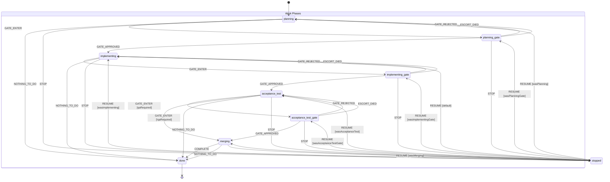
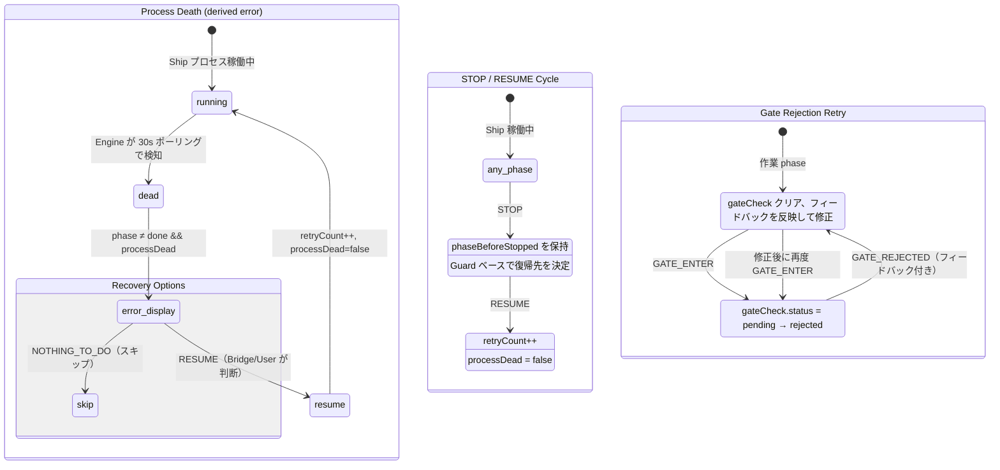

# ADR-0004: XState 状態機械の可視化

- **Status**: Proposed
- **Date**: 2026-03-22
- **Issue**: [#561](https://github.com/mizunowanko-org/vibe-admiral/issues/561)
- **Tags**: engine, ship, escort, xstate, visualization, mermaid

## Context

[#538](https://github.com/mizunowanko-org/vibe-admiral/issues/538) で Ship/Escort ライフサイクルを XState v5 状態機械に移行した。ライフサイクル管理はシステムの根幹であり、状態遷移の正しさをユーザーが視覚的にレビューできる手段が必要。

状態遷移は基本的に直列（planning → planning-gate → implementing → ... → done）で、異常系として stopped/resume サイクル、gate rejection、process death がある。可視化ツールとしては Mermaid stateDiagram-v2 が GitHub でネイティブレンダリングされるため、ツール依存なし・ログイン不要で閲覧可能。

## Decision

XState machine 定義（`engine/src/ship-machine.ts`）を Mermaid `stateDiagram-v2` で可視化し、本 ADR に埋め込む。

### Ship ライフサイクル状態遷移図



### Gate フロー詳細図

各 gate phase で Escort プロセスが起動し、レビューを実施する。


### 異常系フロー



### 状態一覧

| Phase | 種別 | Entry Action | 遷移先 |
|-------|------|-------------|--------|
| `planning` | 作業 | — | planning-gate, stopped, done |
| `planning-gate` | Gate | gateCheck 生成 (plan-review) | implementing, planning, stopped |
| `implementing` | 作業 | — | implementing-gate, stopped, done |
| `implementing-gate` | Gate | gateCheck 生成 (code-review) | acceptance-test, implementing, stopped |
| `acceptance-test` | 作業 | — | acceptance-test-gate, merging, stopped, done |
| `acceptance-test-gate` | Gate | gateCheck 生成 (playwright) | merging, acceptance-test, stopped |
| `merging` | 作業 | — | done, stopped |
| `done` | 終了 | — | (final) |
| `stopped` | 停止 | phaseBeforeStopped 保存 | RESUME で元 phase に復帰 |

### グローバルイベント（全状態で受信可能）

| Event | 効果 |
|-------|------|
| `PROCESS_OUTPUT` | lastOutputAt 更新、processDead クリア |
| `PROCESS_DIED` | processDead = true |
| `COMPACT_START` | isCompacting = true |
| `COMPACT_END` | isCompacting = false |
| `SET_SESSION_ID` | sessionId 更新 |
| `SET_PR_URL` | prUrl 更新 |
| `SET_QA_REQUIRED` | qaRequired トグル |
| `SET_PR_REVIEW_STATUS` | prReviewStatus 更新 |

### 表示状態の導出ルール

```
phase = done                    → "done" (成功)
phase ≠ done && !processDead    → phase そのまま表示 (正常稼働中)
phase ≠ done && processDead     → "error" (異常終了、要対応)
```

## Consequences

**Positive**:
- 状態遷移の全体像を GitHub 上で視覚的にレビューできる
- ツール依存なし（Mermaid は GitHub ネイティブレンダリング）
- ADR として設計判断の記録を兼ねる
- 新規メンバーのオンボーディングに活用できる

**Negative**:
- XState machine 定義と Mermaid 図は手動で同期する必要がある
- Machine 定義変更時に ADR の図も更新が必要（ただし変更頻度は低い）
