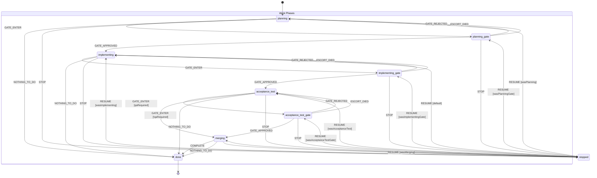
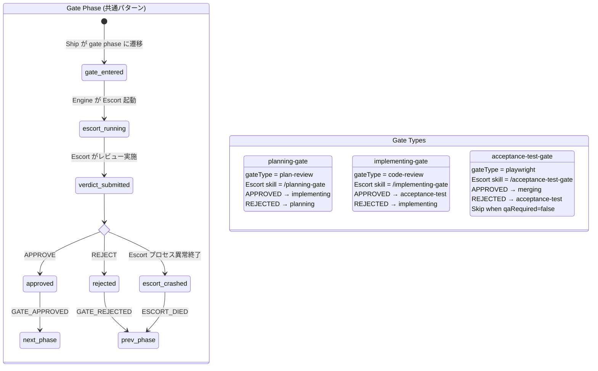
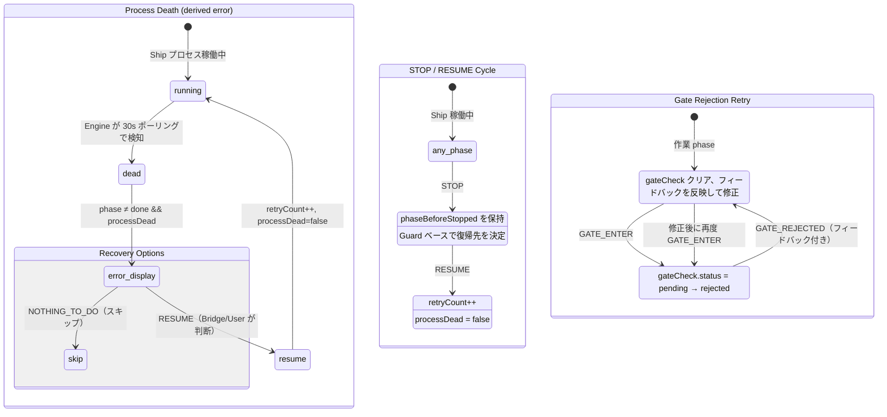

# ADR-0004: XState 状態機械の可視化

- **Status**: Proposed
- **Date**: 2026-03-22
- **Issue**: [#561](https://github.com/mizunowanko-org/vibe-admiral/issues/561), [#573](https://github.com/mizunowanko-org/vibe-admiral/issues/573)
- **Tags**: engine, ship, escort, xstate, visualization, mermaid

## Context

[#538](https://github.com/mizunowanko-org/vibe-admiral/issues/538) で Ship/Escort ライフサイクルを XState v5 状態機械に移行した。ライフサイクル管理はシステムの根幹であり、状態遷移の正しさをユーザーが視覚的にレビューできる手段が必要。

状態遷移は基本的に直列（planning → planning-gate → implementing → ... → done）で、異常系として stopped/resume サイクル、gate rejection、process death がある。可視化ツールとしては Mermaid stateDiagram-v2 が GitHub でネイティブレンダリングされるため、ツール依存なし・ログイン不要で閲覧可能。

## Decision

XState machine 定義（`engine/src/ship-machine.ts`）を Mermaid `stateDiagram-v2` で可視化し、本 ADR に埋め込む。

### Ship ライフサイクル状態遷移図



### Gate フロー詳細図

各 gate phase で Escort プロセスが起動し、レビューを実施する。



### 異常系フロー



### 状態一覧

| Phase | 種別 | Entry Action | 遷移先 |
|-------|------|-------------|--------|
| `planning` | 作業 | — | planning-gate, stopped, done |
| `planning-gate` | Gate | gateCheck 生成 (plan-review) | implementing, planning, stopped |
| `implementing` | 作業 | — | implementing-gate, stopped, done |
| `implementing-gate` | Gate | gateCheck 生成 (code-review) | acceptance-test, implementing, stopped |
| `acceptance-test` | 作業 | — | acceptance-test-gate, merging, stopped, done |
| `acceptance-test-gate` | Gate | gateCheck 生成 (playwright) | merging, acceptance-test, stopped |
| `merging` | 作業 | — | done, stopped |
| `done` | 終了 | — | (final) |
| `stopped` | 停止 | phaseBeforeStopped 保存 | RESUME で元 phase に復帰 |

### グローバルイベント（全状態で受信可能）

| Event | 効果 |
|-------|------|
| `PROCESS_OUTPUT` | lastOutputAt 更新、processDead クリア |
| `PROCESS_DIED` | processDead = true |
| `COMPACT_START` | isCompacting = true |
| `COMPACT_END` | isCompacting = false |
| `SET_SESSION_ID` | sessionId 更新 |
| `SET_PR_URL` | prUrl 更新 |
| `SET_QA_REQUIRED` | qaRequired トグル |
| `SET_PR_REVIEW_STATUS` | prReviewStatus 更新 |

### 表示状態の導出ルール

```
phase = done                    → "done" (成功)
phase ≠ done && !processDead    → phase そのまま表示 (正常稼働中)
phase ≠ done && processDead     → "error" (異常終了、要対応)
```

## Phase Transition Specification

XState machine 定義（`engine/src/ship-machine.ts`）と 1 対 1 で対応する、全遷移パターンの事前条件・副作用仕様。

### 1. planning → planning-gate

| 項目 | 内容 |
|------|------|
| **トリガー** | Ship が `POST /api/ship/:id/phase-transition { phase: "planning-gate" }` を呼ぶ |
| **事前条件（Guard）** | 現在の phase が `planning` であること / forward-only 制約を満たすこと / 5 秒以内の重複遷移でないこと |
| **副作用（Actions）** | - DB: `phase_transitions` に audit log 挿入、`ships.phase` 更新（トランザクション）<br>- Engine: `setGateCheck(shipId, "planning-gate", "plan-review")` で gateCheck 生成<br>- XState: Actor に `GATE_ENTER` イベント送信<br>- Engine: `escortManager.launchEscort()` で Escort 起動（スキル: `/planning-gate`）<br>- Frontend: `ship:status` broadcast で UI 更新 |
| **失敗時** | Phase mismatch → 400 エラー、遷移なし / 重複遷移 → DB 層で抑制（5 秒以内の同一遷移は no-op）、API は 200 OK を返すが副作用は発生しない |

### 2. planning-gate → implementing（Escort approve）

| 項目 | 内容 |
|------|------|
| **トリガー** | Escort が `POST /api/ship/:id/gate-verdict { verdict: "approve" }` を呼ぶ |
| **事前条件（Guard）** | 現在の phase が `planning-gate` であること / verdict が `"approve"` |
| **副作用（Actions）** | - DB: `phase_transitions` に audit log 挿入（metadata: `gate_result: "approved"`）、`ships.phase` → `implementing`<br>- Engine: `clearGateCheck(shipId)` で gateCheck クリア<br>- XState: Actor に `GATE_APPROVED` イベント送信 → gateCheck コンテキストクリア<br>- Frontend: `ship:status` broadcast で UI 更新 |
| **失敗時** | Gate phase 不一致 → 400 エラー、遷移なし |

### 3. planning-gate → planning（Escort reject）

| 項目 | 内容 |
|------|------|
| **トリガー** | Escort が `POST /api/ship/:id/gate-verdict { verdict: "reject", feedback: "..." }` を呼ぶ |
| **事前条件（Guard）** | 現在の phase が `planning-gate` であること / verdict が `"reject"` |
| **副作用（Actions）** | - DB: `phase_transitions` に audit log 挿入（metadata: `gate_result: "rejected"`, `feedback`）、`ships.phase` → `planning`<br>- Engine: `clearGateCheck(shipId)` で gateCheck クリア<br>- XState: Actor に `GATE_REJECTED` イベント送信 → `clearGateCheck` のみ（feedback は XState コンテキストには保存されず、DB metadata に記録）<br>- Frontend: `ship:status` broadcast で UI 更新<br>- Ship: ポーリングで phase 変更を検知、phase-transition-log API から feedback を取得して修正を実施 |
| **失敗時** | Gate phase 不一致 → 400 エラー、遷移なし |

### 4. implementing → implementing-gate

| 項目 | 内容 |
|------|------|
| **トリガー** | Ship が `POST /api/ship/:id/phase-transition { phase: "implementing-gate" }` を呼ぶ |
| **事前条件（Guard）** | 現在の phase が `implementing` であること / forward-only 制約を満たすこと / 5 秒以内の重複遷移でないこと |
| **副作用（Actions）** | - DB: `phase_transitions` に audit log 挿入、`ships.phase` 更新（トランザクション）<br>- Engine: `setGateCheck(shipId, "implementing-gate", "code-review")` で gateCheck 生成<br>- XState: Actor に `GATE_ENTER` イベント送信<br>- Engine: `escortManager.launchEscort()` で Escort 起動（スキル: `/implementing-gate`）<br>- Frontend: `ship:status` broadcast で UI 更新 |
| **失敗時** | Phase mismatch → 400 エラー、遷移なし / 重複遷移 → DB 層で抑制（5 秒以内の同一遷移は no-op）、API は 200 OK を返すが副作用は発生しない |

### 5. implementing-gate → acceptance-test（Escort approve）

| 項目 | 内容 |
|------|------|
| **トリガー** | Escort が `POST /api/ship/:id/gate-verdict { verdict: "approve" }` を呼ぶ |
| **事前条件（Guard）** | 現在の phase が `implementing-gate` であること / verdict が `"approve"` |
| **副作用（Actions）** | - DB: `phase_transitions` に audit log 挿入（metadata: `gate_result: "approved"`）、`ships.phase` → `acceptance-test`<br>- Engine: `clearGateCheck(shipId)` で gateCheck クリア<br>- XState: Actor に `GATE_APPROVED` イベント送信 → gateCheck コンテキストクリア<br>- Frontend: `ship:status` broadcast で UI 更新 |
| **失敗時** | Gate phase 不一致 → 400 エラー、遷移なし |

### 6. implementing-gate → implementing（Escort reject）

| 項目 | 内容 |
|------|------|
| **トリガー** | Escort が `POST /api/ship/:id/gate-verdict { verdict: "reject", feedback: "..." }` を呼ぶ |
| **事前条件（Guard）** | 現在の phase が `implementing-gate` であること / verdict が `"reject"` |
| **副作用（Actions）** | - DB: `phase_transitions` に audit log 挿入（metadata: `gate_result: "rejected"`, `feedback`）、`ships.phase` → `implementing`<br>- Engine: `clearGateCheck(shipId)` で gateCheck クリア<br>- XState: Actor に `GATE_REJECTED` イベント送信 → `clearGateCheck` のみ（feedback は XState コンテキストには保存されず、DB metadata に記録）<br>- Frontend: `ship:status` broadcast で UI 更新<br>- Ship: ポーリングで phase 変更を検知、phase-transition-log API から feedback を取得して修正を実施 |
| **失敗時** | Gate phase 不一致 → 400 エラー、遷移なし |

### 7. acceptance-test → acceptance-test-gate

| 項目 | 内容 |
|------|------|
| **トリガー** | Ship が `POST /api/ship/:id/phase-transition { phase: "acceptance-test-gate" }` を呼ぶ |
| **事前条件（Guard）** | 現在の phase が `acceptance-test` であること / `qaRequired` が `true`（XState Guard: `canSkipQA` を満たさない）/ forward-only 制約を満たすこと / 5 秒以内の重複遷移でないこと |
| **副作用（Actions）** | - DB: `phase_transitions` に audit log 挿入、`ships.phase` 更新（トランザクション）<br>- Engine: `setGateCheck(shipId, "acceptance-test-gate", "playwright")` で gateCheck 生成<br>- XState: Actor に `GATE_ENTER` イベント送信<br>- Engine: `escortManager.launchEscort()` で Escort 起動（スキル: `/acceptance-test-gate`）<br>- Frontend: `ship:status` broadcast で UI 更新 |
| **失敗時** | Phase mismatch → 400 エラー、遷移なし / 重複遷移 → DB 層で抑制（5 秒以内の同一遷移は no-op）、API は 200 OK を返すが副作用は発生しない |

> **注**: `qaRequired === false` の場合、XState の `canSkipQA` Guard により `GATE_ENTER` で直接 `merging` に遷移する。Ship は `acceptance-test-gate` ではなく `merging` に phase-transition を呼ぶ。

### 8. acceptance-test-gate → merging（Escort approve）

| 項目 | 内容 |
|------|------|
| **トリガー** | Escort が `POST /api/ship/:id/gate-verdict { verdict: "approve" }` を呼ぶ |
| **事前条件（Guard）** | 現在の phase が `acceptance-test-gate` であること / verdict が `"approve"` |
| **副作用（Actions）** | - DB: `phase_transitions` に audit log 挿入（metadata: `gate_result: "approved"`）、`ships.phase` → `merging`<br>- Engine: `clearGateCheck(shipId)` で gateCheck クリア<br>- XState: Actor に `GATE_APPROVED` イベント送信 → gateCheck コンテキストクリア<br>- Frontend: `ship:status` broadcast で UI 更新 |
| **失敗時** | Gate phase 不一致 → 400 エラー、遷移なし |

### 9. acceptance-test-gate → acceptance-test（Escort reject）

| 項目 | 内容 |
|------|------|
| **トリガー** | Escort が `POST /api/ship/:id/gate-verdict { verdict: "reject", feedback: "..." }` を呼ぶ |
| **事前条件（Guard）** | 現在の phase が `acceptance-test-gate` であること / verdict が `"reject"` |
| **副作用（Actions）** | - DB: `phase_transitions` に audit log 挿入（metadata: `gate_result: "rejected"`, `feedback`）、`ships.phase` → `acceptance-test`<br>- Engine: `clearGateCheck(shipId)` で gateCheck クリア<br>- XState: Actor に `GATE_REJECTED` イベント送信 → `clearGateCheck` のみ（feedback は XState コンテキストには保存されず、DB metadata に記録）<br>- Frontend: `ship:status` broadcast で UI 更新<br>- Ship: ポーリングで phase 変更を検知、phase-transition-log API から feedback を取得して修正を実施 |
| **失敗時** | Gate phase 不一致 → 400 エラー、遷移なし |

### 10. merging → done

| 項目 | 内容 |
|------|------|
| **トリガー** | Ship が `POST /api/ship/:id/phase-transition { phase: "done" }` を呼ぶ |
| **事前条件（Guard）** | 現在の phase が `merging` であること / forward-only 制約を満たすこと |
| **副作用（Actions）** | - DB: `phase_transitions` に audit log 挿入、`ships.phase` → `done`（トランザクション）<br>- XState: Actor に `COMPLETE` イベント送信 → final state に遷移<br>- Frontend: `ship:status` broadcast で UI 更新<br>- Engine: Actor subscription 終了（final state）、以降のイベントは無視 |
| **失敗時** | Phase mismatch → 400 エラー、遷移なし |

### 11. 任意の work phase → stopped（STOP）

| 項目 | 内容 |
|------|------|
| **トリガー** | User/Bridge が Engine 経由で STOP を要求 → XState Actor に `STOP` イベント |
| **事前条件（Guard）** | 現在の phase が `done` でないこと（全 work phase + gate phase で STOP を受け付ける） |
| **副作用（Actions）** | - XState: `phaseBeforeStopped` に現在の phase を保存<br>- Engine: `processManager.kill()` で Ship プロセスを kill<br>- DB: `ships.phase` → `stopped`（`updatePhase` 経由 — `transitionPhase` のトランザクション制約・forward-only 検証は経由せず、`updateShipPhase` + `recordPhaseTransition` を個別に実行）<br>- Frontend: `ship:status` broadcast で UI 更新 |
| **失敗時** | `done` 状態の Ship に対する STOP → イベント無視（final state） |

### 12. stopped → 停止前の phase（RESUME）

| 項目 | 内容 |
|------|------|
| **トリガー** | User/Bridge が Engine 経由で RESUME を要求 → XState Actor に `RESUME` イベント |
| **事前条件（Guard）** | 現在の phase が `stopped` であること / `phaseBeforeStopped` に基づく Guard（`wasPlanning`, `wasPlanningGate`, `wasImplementing`, `wasImplementingGate`, `wasAcceptanceTest`, `wasAcceptanceTestGate`, `wasMerging`）で復帰先を決定 |
| **副作用（Actions）** | - XState: `processDead = false`、`retryCount++`<br>- Engine: 旧プロセスを kill（まだ残っている場合）、新しい Ship プロセスを起動<br>- DB: `ships.phase` → 復帰先 phase（`updatePhase` 経由 — `transitionPhase` のトランザクション制約は経由せず、`updateShipPhase` + `recordPhaseTransition` を個別に実行）<br>- Frontend: `ship:status` broadcast で UI 更新 |
| **失敗時** | `phaseBeforeStopped` が不明な場合 → `implementing` にフォールバック |

### 13. 任意の phase → done（NOTHING_TO_DO）

| 項目 | 内容 |
|------|------|
| **トリガー** | Ship が `POST /api/ship/:id/nothing-to-do { reason: "..." }` を呼ぶ |
| **事前条件（Guard）** | Ship が存在すること（phase チェックなし — どの phase からでも遷移可能） |
| **副作用（Actions）** | - DB: `phase_transitions` に audit log 挿入（metadata: `reason`, `nothingToDo: true`）、`ships.phase` → `done`<br>- XState: Actor に `NOTHING_TO_DO` イベント送信<br>- Frontend: `ship:status` broadcast で UI 更新 |
| **失敗時** | Ship 未存在 → 404 エラー |

### 汎用パターン: Process Death → Error 表示

| 項目 | 内容 |
|------|------|
| **トリガー** | Engine の ProcessManager が 30 秒間隔ポーリングで Ship プロセス死亡を検知 |
| **事前条件** | Ship プロセスが異常終了していること / 現在の phase が `done` でないこと |
| **副作用** | - XState: Actor に `PROCESS_DIED` イベント送信 → `processDead = true`（phase 遷移は発生しない）<br>- Frontend: 表示状態が `"error"` に変化（derived state: `phase ≠ done && processDead`） |
| **復旧手段** | - `RESUME`: `processDead = false`, `retryCount++` で復帰<br>- `NOTHING_TO_DO`: done へスキップ<br>- `ABANDON`（stopped 時のみ）: 強制 done 遷移（ゾンビ Ship のクリーンアップ） |

### 汎用パターン: Escort 異常終了（ESCORT_DIED）

| 項目 | 内容 |
|------|------|
| **トリガー** | Escort プロセスが非ゼロ終了コードで終了 → Engine が検知 → XState Actor に `ESCORT_DIED` イベント |
| **事前条件** | 現在の phase が gate phase（planning-gate / implementing-gate / acceptance-test-gate）であること |
| **副作用** | - XState: `clearGateCheck` のみ（終了コードは XState コンテキストには保存されない）、前の作業 phase に遷移<br>- DB: `phase_transitions` に audit log 挿入（gate-verdict API 経由の場合のみ metadata に記録）<br>- Frontend: `ship:status` broadcast でエラー情報を表示 |
| **復旧手段** | Ship が作業 phase に戻った後、修正して再度 gate phase に遷移 |

## Consequences

**Positive**:
- 状態遷移の全体像を GitHub 上で視覚的にレビューできる
- ツール依存なし（Mermaid は GitHub ネイティブレンダリング）
- ADR として設計判断の記録を兼ねる
- 新規メンバーのオンボーディングに活用できる

**Negative**:
- XState machine 定義と Mermaid 図は手動で同期する必要がある
- Machine 定義変更時に ADR の図も更新が必要（ただし変更頻度は低い）
