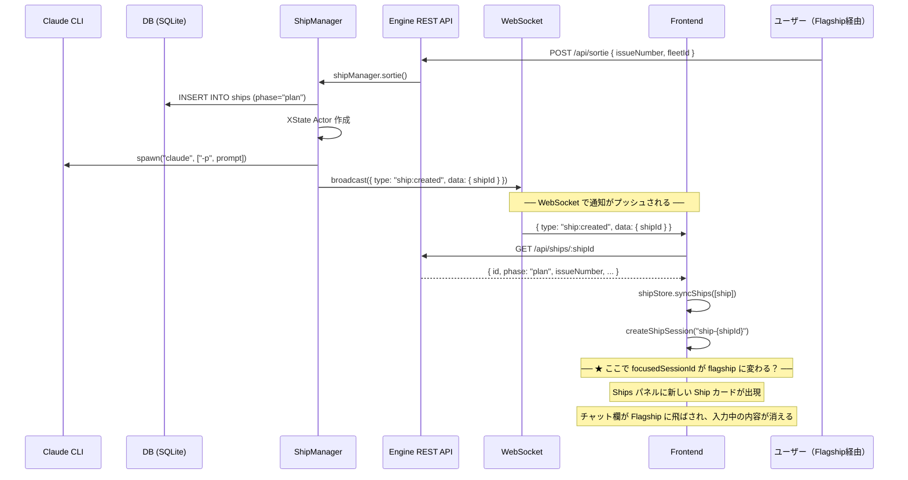
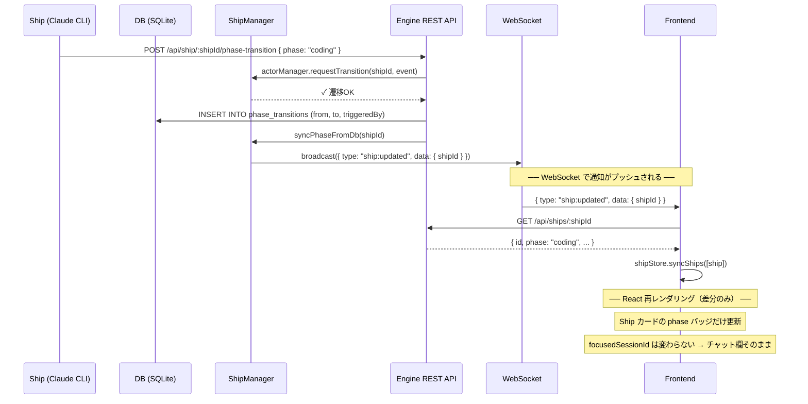

# Sortie → Ships パネル表示と Phase 変更の WebSocket シーケンス

画面リフレッシュ問題の調査・対処にあたり、「sortie してから Ship が Ships パネルに表示されるまで」と「phase が変わるとき」のデータフローを正確に理解するためのドキュメント。

## 「リフレッシュ」とは

Sortie 実行後に **Flagship のチャット欄に飛ばされ、入力中だったチャット欄の input が消える** 現象。Phase 変更時には発生しない。

---

## WebSocket の基礎

WebSocket（WS）は、サーバーとブラウザの間で **双方向・常時接続** の通信路を開く仕組み。

### 通常の HTTP（REST API）との違い

```
【HTTP / REST API】
  Frontend → Engine: リクエスト送る
  Engine → Frontend: レスポンス返す
  （接続切れる。次のデータが欲しければまたリクエスト）

【WebSocket】
  Frontend ←→ Engine: 一度つないだら開きっぱなし
  Engine → Frontend: いつでもメッセージを送れる（Frontend が聞いてなくても）
  Frontend → Engine: いつでもメッセージを送れる
```

### vibe-admiral での使い方

```
Engine (port 9721)
  ├─ REST API: Frontend や Ship が「命令」を送る（sortie 実行、phase 変更など）
  └─ WebSocket: Engine が Frontend に「通知」をプッシュする（ship:created, ship:updated など）
```

**ポイント**: 命令は REST API、通知は WebSocket。

Frontend は WebSocket メッセージを受け取ったら、REST API で最新データを取りに行く（通知 → 取得の2段階）。

---

## フロー 1: Sortie → Ships パネルに表示されるまで



### コード箇所

| ステップ | ファイル | 行 |
|---------|--------|-----|
| API エンドポイント（バリデーション） | `engine/src/api-server.ts` | 53-71 |
| API エンドポイント（ルートハンドラ） | `engine/src/api-server.ts` | 832-872 |
| Ship 作成（sortie メソッド） | `engine/src/ship-manager.ts` | 116-291 |
| DB 保存 | `engine/src/ship-manager.ts` | 231 |
| CLI 起動 | `engine/src/ship-manager.ts` | 286 |
| WS broadcast（ship:created） | `engine/src/ws-server.ts` | 641 |
| Frontend 受信 | `src/hooks/useEngine.ts` | 91-103 |
| Store 更新 | `src/stores/shipStore.ts` | 197-206 |

---

## フロー 2: Phase 変更 → UI 更新



### コード箇所

| ステップ | ファイル | 行 |
|---------|--------|-----|
| Phase transition API | `engine/src/api-server.ts` | 242-450 |
| XState 検証 | `engine/src/api-server.ts` | 303-328 |
| DB 記録 | `engine/src/api-server.ts` | 331-338 |
| Phase sync | `engine/src/ship-manager.ts` | 711-716 |
| WS broadcast（ship:updated） | `engine/src/ws-server.ts` | 601 |
| Frontend 受信 | `src/hooks/useEngine.ts` | 105-117 |
| Store 更新 | `src/stores/shipStore.ts` | 197-206 |

---

## 2つのフローの決定的な違い

| 観点 | Sortie | Phase 変更 |
|------|--------|-----------|
| WS メッセージ | `ship:created` | `ship:updated` |
| Store への影響 | Map に**新しいキー**が追加される | Map の**既存キー**の値が更新される |
| Session 登録 | `createShipSession()` が呼ばれる（**新規**） | 呼ばれない |
| focusedSessionId | **変わる可能性がある** → Flagship に飛ぶ | **変わらない** → チャット維持 |
| チャット input | **消える** | **消えない** |

---

## なぜ Sortie 時だけ Flagship に飛ばされるのか

Sortie フローでは `ship:created` 受信後に以下が連鎖する:

1. `shipStore.syncShips([ship])` → shipStore 更新
2. `createShipSession("ship-{shipId}")` → sessionStore 更新
3. この sessionStore 更新が **focusedSessionId を Flagship に戻してしまう** 可能性がある

Phase 変更では `createShipSession()` が呼ばれないため、sessionStore が変わらず focusedSessionId も維持される。

### 調査すべき原因箇所

1. **`useEngine.ts` の `ship:created` ハンドラ**: `createShipSession()` 後に `setFocus()` を呼んでいないか
2. **`MainPanel.tsx` の useEffect**: `selectedFleetId` の変化に反応して `setFocus("flagship-...")` を呼び直していないか — sortie による Store 更新が依存値を変えて effect が再発火する可能性
3. **sessionStore の `createShipSession()`**: 新 session 登録時に focusedSessionId をリセットするロジックがないか
4. **input draft の永続化**: focusedSessionId が変わると ChatInput がアンマウント → 入力内容が失われる（#621 で persist 対応済みだが、session 切り替え時に復元されない可能性）
